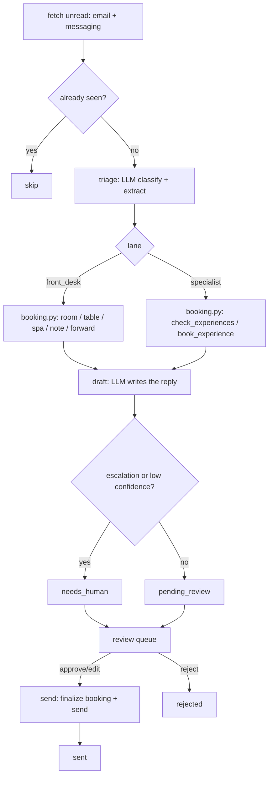

# Front Desk AI - "The Receptionist"

Reads every inbound guest message the moment it lands, classifies intent (booking inquiry, FAQ, arrival time, modification, preference, thank-you…) and manages the three core booking types end-to-end: rooms in the PMS, tables at the restaurant, and treatments at the spa.

## What it does

Reads every inbound guest message the moment it lands, classifies intent (booking inquiry, FAQ, arrival time, modification, preference, thank-you…) and manages the three core booking types end-to-end: rooms in the PMS, tables at the restaurant, and treatments at the spa. Pulls live rates, books, writes the mandatory PMS note, files dietary notes with the restaurant system, and forwards guest facts to the right department (an allergy goes straight to F&B). The instant any booking lands — from the PMS, an OTA, or an accepted upsell — it sends a personalised confirmation in the guest's language and schedules the timed reminders that protect show-up rates on spa, activities and experiences. Replies in the guest's own language and logs every exchange — routine guest mail handled with no human touch.

## What it won't do

Experience bookings — wine tastings, classes, events, party tickets — are handed to the Specialist Booking AIs. Hands the genuinely high-stakes to a human (complaints, legal, large groups, anything it isn't confident on) with full context attached. Never invents a fact: if the knowledge base is missing something, it asks rather than guesses.

## Why it matters

Front desk email is the biggest time sink and the slowest guest touchpoint. This answers in minutes, 24/7, in any language, and never forgets to log a note.

## What to expect

Handles ~70–85% of routine guest email end-to-end; first reply <5 min, 24/7. ~85% intent-classification accuracy live.

The roster text above is quoted exactly as it appears on the demo platform's
agent menu - this repo does not promise more than that, and does not promise
less.

## Who it's for

Independent hotels, guesthouses and small groups where the same one or two
inboxes see every kind of guest question - a booking, a check-in time, an
allergy note, a complaint - and where a person currently reads and types
every reply by hand. It replaces the "read the inbox, work out what it is,
write a reply, remember to note it somewhere" part of a front-desk or
reservations job, not the person doing it.

You will get the most from this repo if:

- You have a PMS or at least a CSV export of your reservations (rooms only -
  the PMS integration does not need to know about your restaurant or spa).
- You run a restaurant and/or a spa alongside the rooms, and currently take
  bookings for them by email or phone.
- Guests write in more than one language.
- You are comfortable reviewing AI-drafted replies before they go out, at
  least at first - this ships in shadow mode and stays there until you say
  otherwise.

It is less of a fit if your booking volume is entirely handled by an OTA
extranet with no direct guest email or chat at all, or if you have no PMS and
no plan to keep even a CSV export current - Front Desk AI needs somewhere to
check availability and record what it did.

## How it works

Two independent loops, plus two folded-in sub-agents that share Loop A's
brain and one coach that reads everyone's history.



**Loop A - the inbox** (`tools/run.py`, `tools/engine.py`). One model call
decides what the guest needs (`prompts/triage.md`): an intent, a language,
which lane owns it, the structured booking fields, and an escalation block
if the message trips a guardrail. The booking itself is always computed by
code, never guessed by the model (`tools/pricing.py`, `tools/booking.py`) -
if a guest asks for a Wednesday table and the restaurant is closed on
Mondays, the code knows that, not the model. A second model call writes the
reply (`prompts/draft.md`). Both calls go through `core.llm.complete()` with
a JSON schema.

**Loop B - the Greeter** (`tools/confirmations.py`). A second, independent
loop that watches for a booking that lands with nobody having written
anything - straight through the PMS, an OTA, the booking widget, or an
accepted upsell - and makes sure the guest still gets a confirmation and the
timed reminders that protect show-up rates, in their own language. No model
call at all; see `docs/how-it-works.md`.

### The two modes

| Mode | What happens |
|---|---|
| `shadow` (default) | Reads, thinks, drafts, previews every booking, and queues. Never sends, never writes to your PMS. |
| `live` | Items you approved are really sent, and the booking behind them is really written. Everything else still waits. |

### The review loop

Nothing reaches a guest, and no booking is written, without a person
approving it first (unless you narrow `review.require_approval_for` once you
trust the drafts). `workflows/80-review.md` covers the full loop: list, show,
approve, edit, reject, send.

### What runs when

| Workflow | Cadence | Provider used |
|---|---|---|
| `workflows/10-front-desk.md` (`tools/run.py`) | every 5 minutes, or `make watch` | whatever `llm.provider` is set to |
| `workflows/15-confirmations.md` (`tools/run.py --confirmations`) | every 15 minutes | none - never calls a model |
| `workflows/20-specialist-booking.md` | same pass as Loop A, off by default | same as Loop A |
| `workflows/21-whatsapp.md` | same pass as Loop A, on by default | same as Loop A |
| `workflows/80-review.md` (`tools/review.py`) | whenever a human is available | none - queue operations only |
| `workflows/85-coach-weekly.md` (`tools/coach.py`) | weekly | one call per proposal |

See `docs/how-it-works.md` for the full flowchart, the exact design
decisions this repo makes where the source system it was built from was
looser, and the idempotency guarantees.

## What you need

| Item | Required? | Notes |
|---|---|---|
| A computer or small server that can run Python 3.11+ | Yes | Your laptop is fine to start; `workflows/90-go-live.md` covers scheduling it properly. |
| A Claude Code subscription, or your own Anthropic API key | Yes | The `interactive` provider uses the Claude Code session you already have open - zero extra cost. See "Run it" below. |
| A mailbox for guest email (IMAP or Gmail), or an export you can read | Recommended | Starts on `mock` fixtures; connect a real one when ready. |
| A PMS, or at least a CSV export of your reservations | Recommended | Starts on `mock` fixtures; the `csv` adapter works with any PMS. |
| A WhatsApp Business number (via your own UniPile account) or a webhook target | Optional | Only needed for the WhatsApp / Live-Chat sub-agent. |
| A Google Sheet, or nothing at all | Optional | Exports default to local CSV files; a Sheet is a nicer place for a human to read them. |

Time estimate: 15 minutes to see the demo, half a day to connect a real
mailbox and fill in your property's `knowledge/` files, a few days of
watching the review queue before you would reasonably consider going live.

## Quick start (5 minutes, no credentials)

```bash
git clone https://github.com/th1-ai/front-desk-ai.git front-desk-ai
cd front-desk-ai
make setup
make demo
```

You should see something like this (shortened):

```
Front Desk AI demo - 10 email(s) + 3 chat message(s) from fixtures/inbound/

Loop A - the inbox

  email email-01: "Check-in time?" -> intent=question lane=front_desk confidence=0.95 status=pending_review
  email email-02: "Classic room, 8 to 10 September" -> intent=room_booking lane=front_desk confidence=0.93 status=pending_review
  email email-03: "Family reunion, 20 guests, late September" -> intent=room_booking lane=front_desk confidence=0.90 status=needs_human
  ...
  whatsapp msg-03: "You charged my card twice for my stay, p" -> intent=other confidence=0.87 status=needs_human

5 of 13 need a person to look first - see knowledge/policies.md for what always does.

Loop B - the Greeter (confirmations + reminders)

  3 booking(s) landed (PMS/OTA fixtures in fixtures/hotel/reservations.json)
  3 confirmation(s) queued
  2 reminder(s) queued
  1 reminder slot(s) already lapsed and dropped

Nothing was sent: mode is shadow, and demo never calls send() at all.
Next: `make review` to see every draft, or read workflows/10-front-desk.md.

DEMO OK - 13 items processed, 13 drafted, 0 sent (shadow)
```

Every one of those messages is an invented sample - a fictional "Hotel
Aurora" - so you can see exactly how Front Desk AI thinks before it ever
touches your real inbox. Next: open `claude` in this folder and follow "Set
up with Claude Code" below.

## Set up with Claude Code

Open `claude` in this folder. Paste each prompt below in order - Claude will
follow the named workflow file, which tells it exactly which tools to run and
what to check.

**Phase 1 - first run.**

> Read `workflows/00-setup.md` and walk me through it. I have not run this
> agent before.

**Phase 2 - the front-desk loop.**

> Read `workflows/10-front-desk.md`. Run one pass and show me what Front Desk
> AI did with each message in plain language.

**Phase 3 - the review queue.**

> Read `workflows/80-review.md`. Show me what is waiting for me, one at a
> time, and act on my decisions.

**Phase 4 - confirmations and reminders (optional, once you have a real PMS
connected).**

> Read `workflows/15-confirmations.md` and run one pass of Loop B. Show me
> what it queued.

**Phase 5 - the two sub-agents (only if you need them).**

> Read `workflows/20-specialist-booking.md` (bookable experiences) and/or
> `workflows/21-whatsapp.md` (chat), and help me turn on whichever one
> applies to us.

**Phase 6 - the weekly coach (after a week of real use).**

> Read `workflows/85-coach-weekly.md` and run this week's analysis. Show me
> each proposal and act on my decisions.

**Phase 7 - going live.**

> Read `workflows/90-go-live.md`. Go through the checklist with me honestly -
> do not recommend going live until it is genuinely true.

You can also just run the agent directly - `/front-desk-ai` in this folder
runs the main loop and works the queue in one command; see
`.claude/skills/front-desk-ai/SKILL.md`.

## Connect your systems

Full detail, including the "implement your own" recipe, is in
`docs/integrations.md`. This section covers only what Front Desk AI itself
uses.

### PMS - `systems.pms.adapter` in `config/hotel.yaml`

| Adapter | Status | Needs |
|---|---|---|
| `mock` | universal | nothing - reads `fixtures/hotel/*.json` |
| `csv` | universal | a CSV export in `data/imports/` - works with any PMS |
| `cloudbeds` | built | `CLOUDBEDS_CLIENT_ID`, `CLOUDBEDS_CLIENT_SECRET`, `CLOUDBEDS_REFRESH_TOKEN`, plus `CLOUDBEDS_PROPERTY_ID` only if your account has more than one property |
| `cli` | universal | `PMS_CLI_COMMAND`, `PMS_CLI_PROFILE` - a JSON-speaking vendor CLI |

Front Desk AI reads room types and rates from `config/agent.yaml` (not from
the PMS) for pricing, and writes the mandatory booking note via
`pms.add_note()` once a room/table/spa reply is approved and sent. Loop B
also reads `pms.list_reservations()` to catch a booking that landed without
a guest email - see `workflows/15-confirmations.md`.

### Email - `systems.email.adapter`

| Adapter | Status | Needs |
|---|---|---|
| `mock` | universal | nothing - reads `fixtures/inbound/*.json` |
| `imap` | universal | `EMAIL_ADDRESS`, `EMAIL_PASSWORD` (an app password), `IMAP_HOST`, `SMTP_HOST`, `SMTP_PORT` |
| `gmail` | built | `GOOGLE_CREDENTIALS_FILE`, `GOOGLE_TOKEN_FILE` (OAuth desktop app) |

### Messaging - `systems.messaging.adapter` (WhatsApp / Live-Chat AI)

| Adapter | Status | Needs |
|---|---|---|
| `mock` | universal | nothing - reads `fixtures/inbound/messages.json` |
| `unipile` | built | `UNIPILE_DSN`, `UNIPILE_API_KEY`, `UNIPILE_ACCOUNT_ID` - your own account, your own WhatsApp number |
| `webhook` | universal | `MESSAGING_WEBHOOK_URL` - POST to Zapier, Make, n8n, or your own endpoint |

Only needed if you turn on the WhatsApp / Live-Chat sub-agent -
`workflows/21-whatsapp.md`.

### Sheets - `systems.sheets.adapter`

| Adapter | Status | Needs |
|---|---|---|
| `csv` | universal | nothing - writes `data/exports/*.csv` |
| `google` | built | `GOOGLE_SHEET_ID`, `GOOGLE_SERVICE_ACCOUNT_FILE` |

Used by `make report --json` if you want the numbers in a shared sheet
instead of just the terminal.

### Everything else

`pos`, `accounting`, `reviews`, `calendar`, `payments`, `procurement` and
`locks` are **stubs** in `core/adapters/` - Front Desk AI does not use any of
them itself. If your workflow needs one, `docs/integrations.md` has the
five-step "Implement your own" recipe.

Check what is actually working on your machine at any time:

```bash
make doctor
```

## Run it

```bash
make run                          # one real pass over new email + chat (Loop A)
make run ARGS="--limit 5"         # just the first five messages
make run ARGS="--dry-run"         # compute everything, write nothing
make watch                        # keep Loop A running on the configured interval
python3 tools/run.py --once --confirmations   # one pass of Loop B
python3 tools/run.py --watch --confirmations  # keep Loop B running
```

**Scheduling.** `config/agent.yaml`'s `schedule:` block names every job this
agent actually needs - `triage` (Loop A, every 5 minutes), `confirmations`
(Loop B, every 15 minutes) and `coach` (the weekly review, Monday 03:00) -
each with its own real command. Print all three, already filled in with the
right absolute paths for this machine, with:

```bash
make schedule ARGS="--all"
```

Paste that straight into `crontab -e`. `scheduler/crontab.example`,
`scheduler/launchd.example.plist` and `scheduler/systemd.example.service` plus
`scheduler/systemd.example.timer` have one hand-editable example each, for a
Mac, a Linux box, or a VPS, if you would rather not use `--all`.
`make schedule` on its own (see `core/schedule.py`) generates a snippet for
any single command and cadence you name.

**Subscription or API.** `llm.provider: interactive` or `claude-code` runs on
the Claude Code subscription you already pay for - genuinely the cheapest way
to run a small property's agent, with the caveat that Anthropic's usage
policy governs automated use of a personal subscription (a handful of
scheduled runs a day is normal; hammering it around the clock is not).
`llm.provider: anthropic` uses your own API key, bills per token, and is the
right choice for production volume. `make report` shows what you are
actually spending either way - see `docs/safety.md` for the full honest
note.

## Go live

Shadow mode is the default and stays the default until you change it. The
full checklist - real config filled in, a few days of real review behind you,
the AI-disclosure line added, a real mailbox connected - is in
`workflows/90-go-live.md`. In short:

```yaml
# config/hotel.yaml
mode: live
```

Going live means an **approved** item now actually sends, and the booking
behind it is actually written - it does not change what needs approval.
`review.require_approval_for` still lists `send_email`, `send_message` and
`pms_write` by default. Going back to shadow (`mode: shadow`, or
`AGENT_MODE=shadow` in `.env` for one run) stops every outbound action
immediately, mid-schedule.

## Guardrails & safety

Full detail in `docs/safety.md`. The short version:

**What it will not do.**

- Send anything while `mode: shadow`, or send an item nobody approved.
- Write to your PMS, book a room/table/spa/experience, or forward a guest
  fact without a human having approved the reply first.
- Take a payment, issue a refund, or move money - payment adapters are
  read-only by design.
- Invent a fact, a price, a date, or an availability that is not in
  `knowledge/` or computed by `tools/pricing.py`. When it is not sure, it
  asks - it never guesses.

**What always escalates**, whatever the model itself decides
(`knowledge/policies.md`, enforced in code by `tools/engine.py`):

- Refunds, cancellations outside policy, any payment dispute or double
  charge.
- Injury, safety, a legal threat, a complaint about a named staff member.
- A medical need, a mobility need, or a pregnancy.
- Large groups: 6+ rooms, 15+ guests, or a party of 10+ at your restaurant.
- Anything the model itself is under 80% confident about.

**Data handling.** Everything lives in `data/agent.db` on your own machine -
there is no cloud service behind this repo. Card numbers are redacted on
ingestion (`core/redact.py`) before they are stored, logged, or put in a
prompt, regardless of any config setting. `privacy.retention_days` controls
how long processed items stay in the database.

**AI disclosure (EU AI Act Article 50).** Every guest-facing reply this
repo drafts carries a line saying it was prepared with AI assistance and
reviewed by a person - see `knowledge/signature.example.md` for the wording
and `docs/safety.md` for the full context. Keep the escape hatch: a guest who
wants a human should never have to work out how to get one.

## Sub-agents in this repo

Two sub-agents share Loop A's triage brain, and one coach reads everyone's
history. All three are covered fully in `docs/sub-agents.md`; the roster
promise for each is below.

### Specialist Booking AIs - "The Specialists"

**Does.** Handles the bookable experiences that live outside the PMS - wine
tastings, sunrise yoga classes, after-work events, ticketed parties like the
rooftop full-moon night. Checks live availability for each session, books
the guest in, takes note of the occasion (birthdays, group sizes), and
confirms in the guest's own language. Each experience line gets its own
specialist sharing one triage brain, so a wine question and a yoga question
are each answered by an expert.

**Won't.** It never books rooms, restaurant tables, or spa treatments -
those are PMS bookings and belong to the Front Desk AI. It stays in its
lane per experience, routes multi-topic messages back through triage, and
hands anything high-stakes or below 80% confidence to a human.

Off by default - see `workflows/20-specialist-booking.md` to turn it on.

### WhatsApp / Live-Chat AI - "The Messenger"

**Does.** Same brain as Front Desk AI but on WhatsApp and website chat:
instant, conversational, in any language, with booking and concierge
actions inline.

**Won't.** Escalates payment disputes and complaints.

On by default - see `workflows/21-whatsapp.md` to connect a real account.

### Email Optimizer / Coach AI

**Does.** The coach class. Each week it reads every guest reply a human
edited, rejected, or thumbed-down, clusters the corrections into patterns,
applies the safe knowledge-base fixes itself, and proposes the rest.

**Won't.** Doesn't talk to guests. Holds the higher-judgement changes for a
human nod; applies the clear-cut ones itself.

On by default (analysis only - it never touches a guest) - see
`workflows/85-coach-weekly.md`.

## Customising

**`knowledge/`.** The agent's memory of your property -
`knowledge/property.md`, `knowledge/faq.md`, `knowledge/policies.md`,
`knowledge/room-descriptions.md`, `knowledge/signature.md`. See
`knowledge/README.md` for how to write each one well. `knowledge/policies.md`
is loaded into every single prompt, so it is the highest-leverage file in
the repo - get the escalation list right before anything else.

**`prompts/`.** `prompts/triage.md` and `prompts/draft.md` are plain
markdown with `{{var}}` placeholders - edit them directly to change how
Front Desk AI reasons or what tone it writes in. The JSON schema each one
must answer to lives next to it in `prompts/schemas/`.

**`config/agent.yaml`.** Your real room types, restaurant hours and closed
days, spa menu, `confidence_threshold`, the `confirmations` block (hold
threshold, reminder timing), and which sub-agents are on.

**Adding a language.** Two places: `hotel.languages` in `config/hotel.yaml`
(the triage step already handles any language the model can read and write -
nothing else to change there), and, for Loop B's confirmations and
reminders, one more entry in `tools/confirmations.py`'s `TEMPLATES` dict -
copy an existing language block, translate it, done. Anything not in
`TEMPLATES` falls back to English automatically.

**Room types, spa treatments, experience sessions.** All three are plain
config or fixture data, not code: `rooms.room_types` and `spa.menu` in
`config/agent.yaml`, and `fixtures/hotel/experiences.json` (or wherever you
point `tools/store_ext.py`'s `seed_experience_sessions` function at) for the Specialist
lane's catalogue.

## Troubleshooting & FAQ

Full list in `workflows/99-troubleshooting.md`. The most common ones:

**`make doctor` shows a FAIL.** Every line has a fix hint right under it -
read it before doing anything else.

**`make run` exits with code 3.** Not an error - `llm.provider: interactive`
is waiting for you to answer a parked prompt in `data/pending/`.

**A room, table or spa reply gets approved but no booking appears.**
`python3 tools/review.py show <id>` shows exactly why `finalize_booking`
failed, rather than silently dropping it.

**Why does the coach need a whole week of data?** It doesn't strictly - you
can run `python3 tools/coach.py analyze` any time. A week is simply enough
volume for `coach.min_cluster_size` (default 2 similar corrections) to find
a real pattern instead of reacting to one edit.

**Can I run this without a PMS at all?** Yes - leave `systems.pms.adapter`
on `mock` or `csv`. Room, table and spa pricing come from `config/agent.yaml`
either way; only the mandatory PMS note and Loop B's PMS-origin bookings
need a real connection.

## Measuring the benefit

`make report` shows volumes, the auto-handled rate, the edit rate, time to
first reply, and spend - all computed from `data/agent.db`, nothing phoned
home. See `docs/benefits.md` for what each number means, how to read the
auto-handled rate honestly while you are still in shadow mode, and the
caveats worth keeping in mind before you quote any of this to someone else.

```bash
make report
python3 tools/report.py --json
```

## About

Built by [TH1](https://th1.ai) - we build and run AI agents for
independent hotels. This repo is free to use, modify and self-host under the
MIT licence (see `LICENSE`).

Want it run for you, tuned to your property, with someone accountable for
the result? [Talk to TH1](https://th1.ai).

**Changelog**

- v1.0 - initial release: Loop A (inbox), Loop B (confirmations +
  reminders), Specialist Booking AIs and WhatsApp / Live-Chat AI folded in,
  Email Optimizer / Coach AI weekly review.
