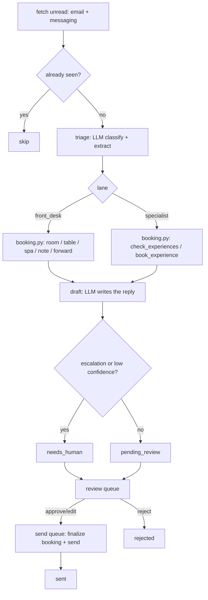
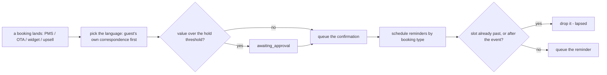

# How Front Desk AI works

Two independent loops, plus two folded-in sub-agents that share Loop A's brain
and one coach that reads everyone's history. Nothing in this file is invented
technology: every piece maps to a `tools/*.py` module you can read end to end.

## Loop A — the inbox (`tools/run.py`, `tools/engine.py`)

One model call decides *what the guest needs and what to do about it*
(`prompts/triage.md`, schema `prompts/schemas/triage.json`): an intent, a
language, which lane owns it (`front_desk` or `specialist`), the structured
booking fields if any, and an escalation block if the message trips a
guardrail. A second model call writes the reply (`prompts/draft.md`). Both go
through `core.llm.complete()` with a JSON schema — nothing else in this repo
calls a model. Whether an item needs a human is a plain rule
(`tools/engine.py:needs_human_for`), not something the model decides.

**Deterministic execution, always.** The triage step never invents a rate, a
table slot or a spa price — `tools/pricing.py` and `tools/booking.py` compute
those from `config/agent.yaml` and the property's own data, the same way for
every provider (`mock`, `interactive`, `claude-code`, `anthropic`). If the
guest asked for a Wednesday table at Aurora Kitchen, the code — not the model —
knows Aurora Kitchen is closed on Mondays and rejects a Monday instead.

## Loop B — the Greeter: confirmations and reminders (`tools/confirmations.py`)

Pure functions, no model call at all: `plan_confirmation()` and
`plan_reminders()` in `tools/confirmations.py`. Every reminder slot and every
language choice traces back to an input field — see "Design decisions" below
for the one place this repo is stricter than the source system it was built
from.

## What runs when

| Workflow | Cadence | Provider used |
|---|---|---|
| `workflows/10-front-desk.md` (`tools/run.py`) | every 5 minutes (`config/agent.yaml: schedule.triage`), or `make watch` | whatever `llm.provider` is set to |
| `workflows/15-confirmations.md` (`tools/run.py --confirmations`) | every 15 minutes, or with each `run.py` pass | none — Loop B never calls a model |
| `workflows/20-specialist-booking.md` | same pass as Loop A, gated by `subagents.specialist_booking.enabled` | same as Loop A |
| `workflows/21-whatsapp.md` | same pass as Loop A, whichever channel the message arrived on | same as Loop A |
| `workflows/80-review.md` (`tools/review.py`) | whenever a human is available | none — queue operations only |
| `workflows/85-coach-weekly.md` (`tools/coach.py`) | weekly (`config/agent.yaml: schedule.coach`) | one call per proposal (`prompts/coach-suggestion.md`) |

## Sub-agents folded into this repo

- **Specialist Booking AIs** — the two experience tools
  (`check_experiences`, `book_experience`) and the four experience sessions.
  Same triage call, same inbox, same JSON contract as Loop A; only the `lane`
  field in the triage result and the tool it calls differ. Toggle:
  `config/agent.yaml: subagents.specialist_booking.enabled`. See
  `workflows/20-specialist-booking.md` and `docs/sub-agents.md`.
- **WhatsApp / Live-Chat AI** — no engine of its own. `item.payload.channel`
  carries `whatsapp`, the draft prompt's tone rule shortens the reply, and
  `tools/run.py` fetches from `core.adapters.get_messaging()` as well as
  `get_email()` in the same pass. See `workflows/21-whatsapp.md`.
- **Email Optimizer / Coach AI** — reads `learnings` (human edits and
  rejections, written automatically by `core.review.edit()`/`reject()`) and
  `escalations` (this repo's own table), clusters them into proposals, and
  waits for a human to accept or reject each one. Accepted proposals become
  lines in `knowledge/rules.md`, appended to the system prompt from then on.
  Never auto-applies. See `workflows/85-coach-weekly.md`.

## Design decisions taken where the spec was open

The behavioural spec this repo was built from
(`../specs/front-desk-ai.md` in the factory that built this template, if you
have it) documents a real production system with several rough edges. Every
one of the following is a deliberate departure, made in the direction of the
architecture this whole family follows (ARCHITECTURE.md section 1: shadow by
default, deterministic decisioning), not an oversight:

1. **Every booking write goes through the review guard, not just sends.** The
   system this was built from creates the room/table/spa booking immediately,
   during Loop A, regardless of review mode — only the *reply* waits for
   approval. That contradicts "shadow mode... never writes to your PMS." Here,
   `tools/booking.py` computes the *would-be* booking (rate, reference
   preview, availability) and stores it on the item's draft; the actual
   `INSERT` — and any real PMS write — happens in `tools/review.py send`,
   at the same moment the confirmation goes out, and only for an item a human
   approved or edited. In `mode: live` with `pms_write` off the approval list
   this collapses back to closer-to-immediate behaviour; the default is
   stricter.
2. **Lane routing is deterministic, not "last tool wins."** The source system
   credits whichever agent's tool ran last, which can mis-credit a message
   that touches both a room and an experience. Here the triage step returns a
   single `lane` field the model commits to up front, and the executor simply
   trusts it — one lane per message, and a genuinely mixed message triggers
   `missing_info` (ask which one first) rather than silent misattribution.
3. **One structured triage call, not a multi-round tool loop.** The system
   this was built from drives the model through several rounds of "call a
   tool, see the result, decide again" against an endpoint with no native
   tool-calling. That transport detail belongs to the infrastructure that ran
   it, not to a portable template. Here, one `triage` call extracts intent,
   lane, and every structured field (dates, party size, treatment, session)
   in a single schema-validated shot; `tools/booking.py` then executes
   deterministically and a second `draft` call writes the prose around the
   result. Simpler, cheaper, and just as auditable.
4. **The mandatory PMS note fires for every booking type.** The source system
   only appends a PMS note automatically after a spa booking. Here,
   `tools/booking.py:finalize_booking()` appends a note for a room, table or
   spa booking alike whenever the message carried a room reference, matching
   the roster's plain promise ("writes the mandatory PMS note").
5. **`forward_to_team` is a real write.** The source system logs a
   "(simulated in this demo)" action and stops. Here it calls
   `core.adapters.get_messaging(settings).notify_staff()`, which is guarded
   like any other send and genuinely reaches whichever messaging adapter is
   configured (a webhook to Slack/Zapier, or a UniPile staff chat). Nothing
   fires while shadow mode blocks it.
6. **Confidence is a hard gate, not a decoration.** `confidence_threshold`
   (default `0.80`) in `config/agent.yaml` is read by
   `tools/engine.py:needs_human_for()` and compared against the model's own
   score. Below it, the item always needs a human, regardless of what the
   model's `action` field says.
7. **A small, explicit language set for confirmations.** Loop B ships
   confirmation and reminder wording for `en`, `fr`, `es` and `pt`
   (`tools/confirmations.py:TEMPLATES`), falling back to `en` for anything
   else, rather than the nine hard-coded languages of the source system. Add
   a language by adding one dict entry — see the comment at the top of that
   file.
8. **`writes_in` becomes `guest_language` on the booking.** When a booking
   arrives attached to an inbound item (an upsell accepted over email, for
   instance), `tools/confirmations.py` prefers the language the guest actually
   corresponded in over any language recorded on the booking itself — "follow
   the guest, not the passport" — falling back to `core.i18n.detect_language`
   on country/phone, then the hotel's default language.
9. **Escalation reasons are the real cause, not a canned label.**
   `tools/engine.py:apply_guardrails()` uses whatever specific error
   `tools/booking.py` already computed (an unknown room type, a missing
   detail, an oversell...) as the escalation reason, and only falls back to
   a generic "large group / party size" line when the booking was otherwise
   valid and only the size tripped the guardrail. A reviewer working the
   queue sees why, not a repeated guess.
10. **A guest language outside `hotel.languages` always needs a human.**
    `tools/engine.py:apply_language_gate()` runs before the draft step: if
    the triage-detected language is not one of the languages configured in
    `config/hotel.yaml`, the reply is written in the hotel's own default
    language instead — never a language nobody on the team can check — and
    the item is queued `needs_human` with the reason recorded, rather than
    silently answering fluently in a language nobody configured.
11. **A modification always needs a human.** Unlike a fresh room, table, spa
    or experience booking, there is no deterministic availability check for
    `modification` — `tools/pricing.py` has no "amend" formula to fall back
    on. `tools/booking.py:compute_pending()` marks every modification
    `needs_human` on purpose, rather than let the draft step imply an
    amendment was actually checked when nothing was.
12. **Currency in every guest-facing string comes from `hotel.currency`.**
    Nothing in `tools/booking.py` or `tools/confirmations.py` hardcodes
    "EUR" — every price shown to a guest reads `settings.hotel.currency`, so
    a non-Eurozone property sees its own currency everywhere a price is
    quoted, not just in numbers that happen to come from the PMS.

## Idempotency

- `core.store.Store.upsert_item(source, external_id, ...)` — unique on
  `(source, external_id)`; refetching the same email or WhatsApp message twice
  never creates a second item.
- `process_message()` checks `item.intent` before doing any work, so a second
  pass over an already-triaged item is a no-op.
- `store_ext.py`'s booking tables use a unique `ref` and Loop B's
  `process_new_bookings()` uses `store.upsert_unique("booking", external_ref, ...)`
  so the same webhook payload replayed twice is a no-op.
- Sending is claimed atomically (`Store.claim_for_send()`), and the actual
  booking `INSERT` happens inside that same claimed transaction in
  `tools/review.py send`, so two runners racing on one approved item can never
  both create the booking or both send the confirmation.
- `experience_sessions.booked` is only ever incremented inside
  `tools/booking.py:book_experience()`, guarded by the same claim, so a
  session cannot be oversold by a double-send.

## Where core stops and this agent starts

Everything in `core/` is byte-identical to the factory's `core/` and shared
across the whole family. Everything in `tools/`, `prompts/`, `fixtures/`,
`workflows/`, `templates` inside `tools/confirmations.py`, and
`config/agent.example.yaml` is Front Desk AI's own.
